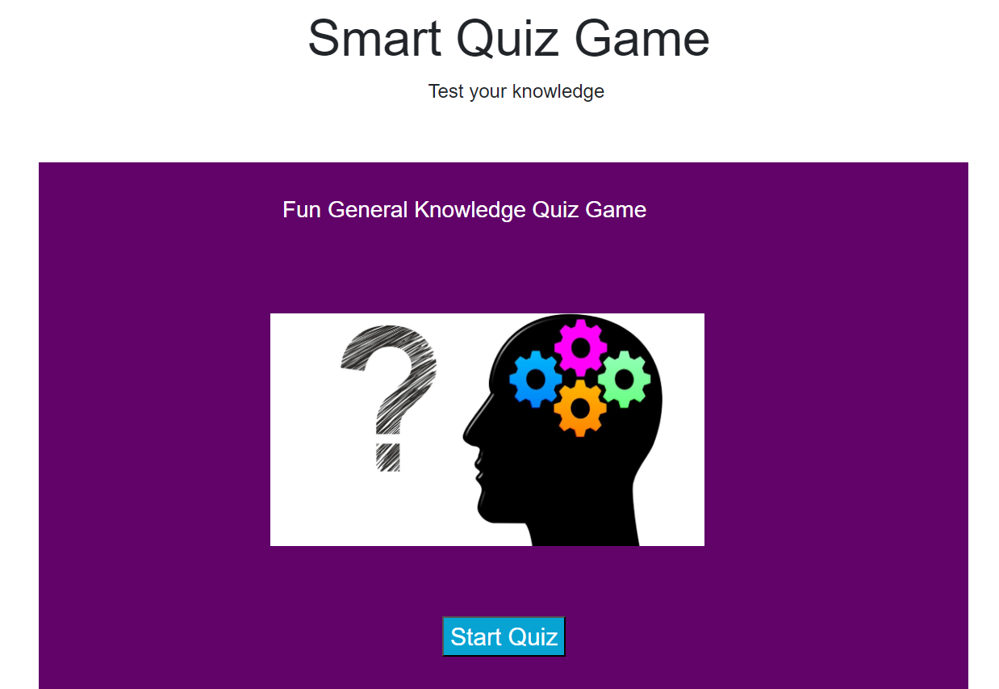
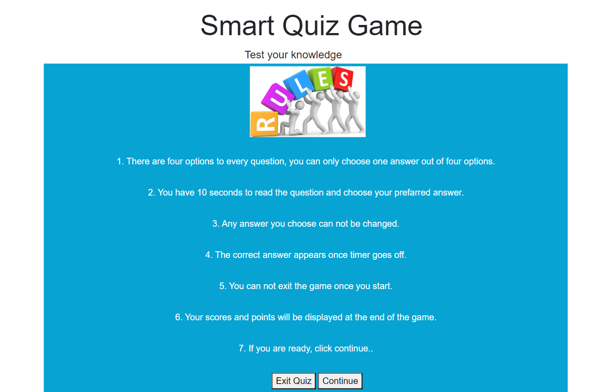
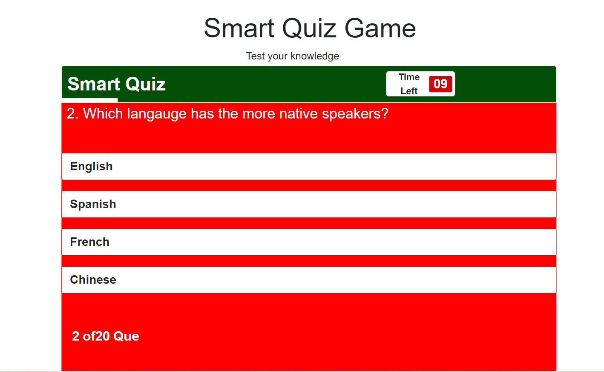
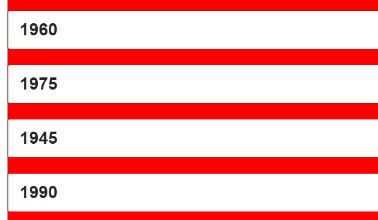
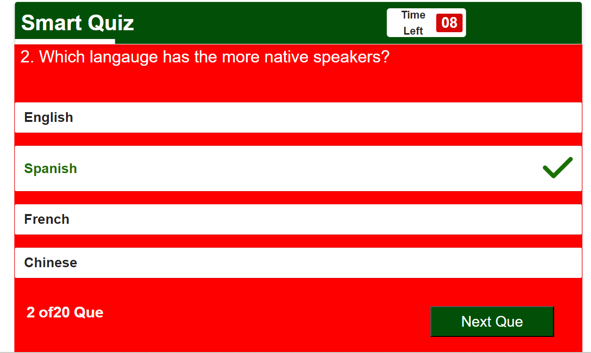
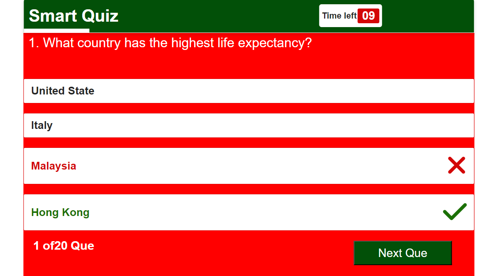
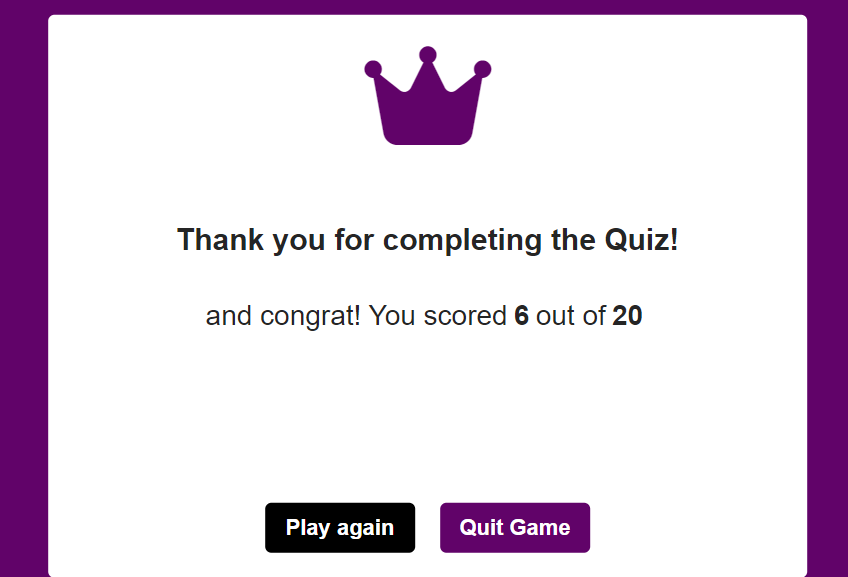
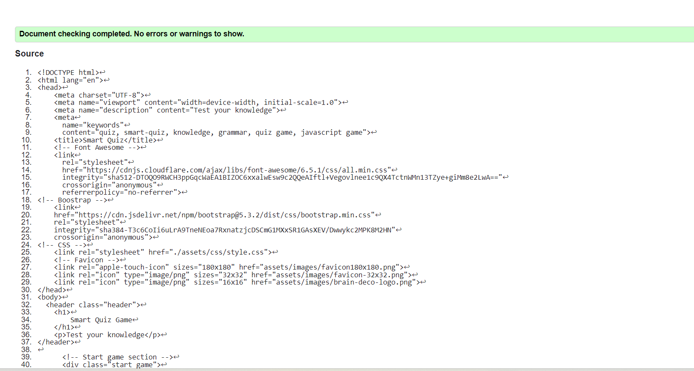
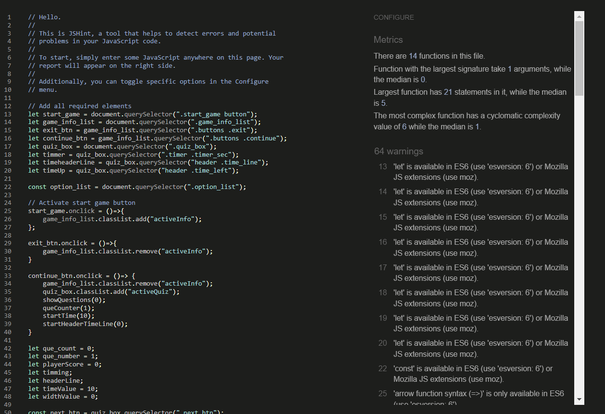
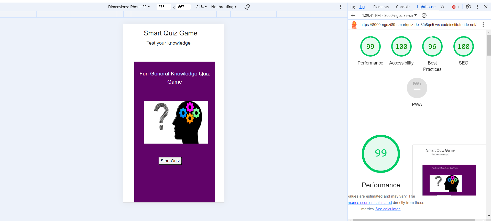

The live link can be found here - <https://ngozi89.github.io/smart_quiz/>

# Smart Quiz App

Smart Quiz app is a fun general quiz game design to test ones knowledge. The live link can be found here - <https://ngozi89.github.io/smart_quiz/>

Smart quiz is a fun to play quiz game, it engage and energize the audience by asking general questions while the auidence choose the answer from the option given. 

Th quiz has 20 questions in total and the player gets one point when he or she answered correctly.

The game has a timer of 10 seconds and players has to read the question and choose answer within 10 seconds. Once the time is up the computer chooses the answer if player is unable to choose but if the player chooses answer the timer stops

The game is coded in a way that the user can not go to the next question until he or she picks an answer or the time is up because the next button is disabled only the display when user pick an answer.

When player answer is correct the next question displays but when the play answer is incorrect, the computer will choose the correct answer and the next button will be displayed.

This quiz game app demonstrate how pure python works in a real-world context, and can be played by anyone from age 16 who love quiz. The questions are carefully sellected to make user to keep playing.

The site is a fully responsive javascript game that will allow users to read questions and give them option to choose their answer regardless of the screen size.

## First Time Visitor Goal

- As a first-time user I want to easily understand what the site main purpose is all about.

- As first-time user I use my phone often, so I want to view the website content clearly on my mobile.

- As a first-time user I want to find the site interesting.

## Returning Visitors Goals

- As a returning use I want to play the game again

## Features

### Existing Features

### Smart quiz app Heading

- The start up page contains heading and a start game button. 

- Featured at the top of the page is the smart quiz app heading and is easy to see for the users.

- Upon viewing the page, the user will be able to see the name of the game and a start game button! This is to fulfill the purpose of user story:

 . As a first-time user I want to easily understand what the site main purpose is all about.

### The Game Area

- The game have sections. The first section allows user to play game by clicking the start game button. Once clicked, the game rules will dispaly. At the game rule section, the user will be able to read the rules of the game and given an option button to choose if he or she wants to play the game or quit. If user choose to contiune, the game section that dispalys the questions will show and at this point, user can not quit game until all questions are answered, while if user choose quit, the game ends and take user back to the start the game section. The last section is the result box that display result when all questions are answered and it show how many questions the user got right and gives opportunity to play again or exit game. This is to fulfill the purpose of user story:

.  As a first-time user I want to find the site interesting.

- The quiz game have a clear information that tells the users what to expect.
- The user have four answer options to choose from
- The user will be able to choose any answer he or she thinks or knows is correct.
- Once the user chooses an answer, its irreversible.
- If the user answer is wrong, the app will mark what the user choosed as well as mark the correct answer.
- The user will have limited time to answer each question. once the user chooses his or her answer the timer stops. If the user can't choose an answer before the given time frame, the app will choose the correct answer automatically.
- At the end of the game the user will see his or her score and can choose wheather to replay the game or quit.

### The Score Area

- The uses will only see result at the end of the game.
- Play again and Exit button

- __The Score Area__

### Features Left to Implement
- No feature left

## Testing

### Validator Testing

- HTML
- No errors were returned when passing through the official [W3C validator](https://validator.w3.org/nu/#textarea) 
- CSS
- No errors were found when passing through the official [(Jigsaw) validator](https://jigsaw.w3.org/css-validator/validator) 
- JavaScript
- No errors were found however, there was warning when passing through the official [Jshint validator](https://jshint.com/) 
- Lighthouse
- I used devtools to run it through lighthouse to test the accessibility, Perfomance and SEO 

## Deployment

- The site was deployed to GitHub pages. The steps to deploy are as follows:
  - In the GitHub repository, navigate to the Settings tab
  - From the source section drop-down menu, select the main Branch
  - Once the main branch has been selected, the page will be automatically refreshed with a detailed ribbon display to indicate the successful deployment.

The live link can be found here - <https://ngozi89.github.io/smart_quiz/>

## Credit

 - Coding Nepal for the details of the quiz game.
